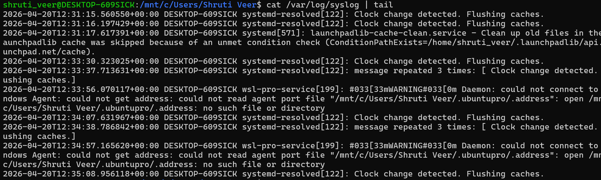
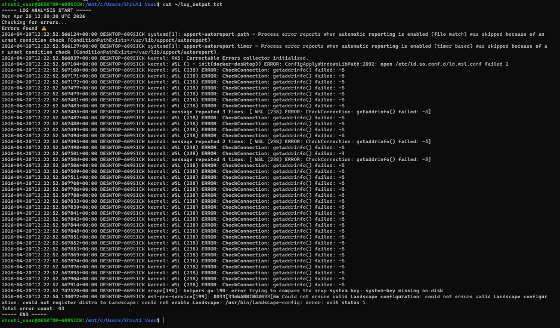
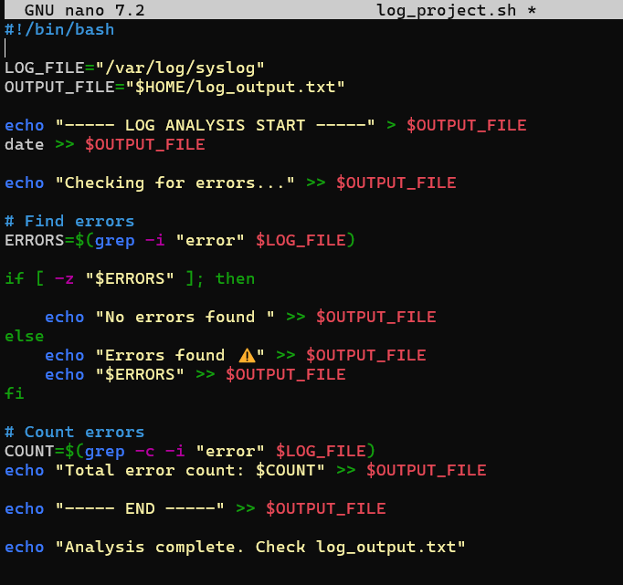

# Log Analyzer Project 

## Description
This is a simple Bash-based log analyzer that scans Linux system logs and detects error messages.

##Features
- Detects error logs
- Counts total errors
- Saves output to a file

##Technologies Used
- Linux
- Bash Scripting

##  How to Run
chmod +x log_project.sh
./log_project.sh

##  Output
The results are saved in:
~/log_output.txt

##  Screenshots

### Raw Logs Input

### Running Script

### Output File

### Script Code

